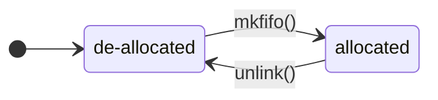

# python-xp-named-pipe

[](https://github.com/psf/black)

Python cross platform named pipe unifying usage of Unix named pipe and Win32
named pipes. Which support system resource management and fifo-file management
with Pythons Context Management Protocol.

Supported platforms:

- [x] win32
- [x] linux

# API Description

> [!NOTE]
> Clone this repository into your project folder and import it from your
> scripts reproduce the following examples.

## NamedPipe

```Python
from xp_named_pipes import NamedPipe

my_pipe = NamedPipe("pipe/path") # Create a new instance of NamedPipe (de-allocated)
my_pipe.mkfifo() # System resources are now allocated

# Use "my_pipe" here

my_pipe.unlink() # System resources are now de-allocated
```

The class `NamedPipe` represents the resource named pipe of the operating
system. An instance of `NamedPipe` can be created by a path which is used to
identify the named pipe of the operating system across processes. An instance
of `NamedPipe` always represents an uni-directional communication channel, even
if the underlying operating system might support bi-directional named pipes.

> [!NOTE]
> The path used to create a named pipe on windows is prepended with a windows
> specific prefix to meet the required naming convention `\\.\pipe\pipename`.
> The prefix is handled transparent in this API, but the allocated system
> resource will have the name: `<prefix>+<API_path>`

### NamedPipe Resource State



- Resource allocation on the operating system is performed by calling `mkfifo()`.
- Resource de-allocation on the operating system is performed by calling `unlink()`.

## ReadPipeEnd & WritePipeEnd

```Python
from xp_named_pipes import NamedPipe, ReadPipeEnd, WritePipeEnd

my_pipe = NamedPipe("pipe/path")
# `mkfifo()` and `unlink()` MUST be omitted if the operating system resource is
# managed by another process.
my_pipe.mkfifo() 

# Create `ReadPipeEnd`, which can read data into this process from `my_pipe`
my_pipe_end = ReadPipeEnd(my_pipe) 

my_pipe_end.open() # Open the `PipeEnd` for operation

print(my_pipe_end.read()) # Read the data

my_pipe_end.close() # Close the `PipeEnd`


my_pipe.unlink()
```

The class `ReadPipeEnd` and `WritePipeEnd` are both `PipeEnd`s. A `NamedPipe`
has exactly one `ReadPipeEnd` and one `WritePipeEnd` that can be opened at the
same time by all processes on the same machine. A `ReadPipeEnd` reads data into
its process and a `WritePipeEnd` writes data from its process.

`PipeEnd`s have to be opened and closed similar to a file to use read/write
methods using `open()` and `close()`.


## Context Management Protocol

`NamedPipe`, `ReadPipeEnd` and `WritePipeEnd` support pythons context
management protocol and can be used with the `with` statement.

```Python
from xp_named_pipes import NamedPipe, ReadPipeEnd, WritePipeEnd

with NamedPipe("pipe/path") as my_pipe: # automatic (de)allocation of system resources
  with ReadPipeEnd(my_pipe) as my_pipe_end: # automatic open/close of PipeEnd
    print(my_pipe_end.read())
```

## Convenience PipeEnd Creation

A `PipeEnd` (either `ReadPipeEnd` or `WritePipeEnd`) is created by specifying
the `NamedPipe` for which the `PipeEnd` should be created. When a `PipeEnd` is
created on a "client" side (which does not manage the system resources) it is
not required to have access to the `NamedPipe` methods `mkfifo()` and
`unlink()`.

The `PipeEnd` can be created with a specification of the `NamedPipe` as a
string instead of an instance of `class NamedPipe`. Operating system resources
are not allocated and cannot be controlled in this context.

`WritePipeEnd("path")` is equivalent to `WritePipeEnd(NamedPipe("path"))`.

```Python
from xp_named_pipes import NamedPipe, ReadPipeEnd, WritePipeEnd

with WritePipeEnd("pipe/path") as my_pipe_end:
  my_pipe_end.write(b"My Data")
```

## Encoded Datagramme Support

The cross platform pipes transfer bytes and the usage of those bytes to
transfer meaningful messages is up to the user. Some operating systems might
not guarantee a complete write (including a flush of possible buffers) on
write. To ease the use to transfer entire messages in a controlled manner the
class `Base64DatagrammeEncoderDecoder` provides an easy way to encode messages
as a `datagramme`. A `datagramme` is the message encoded as Base64 and an
appended delimiter byte `0x00` to delimit individual `datagramme`s. The
`Base64DatagrammeEncoderDecoder` ensures that each `write` corresponds to a
single `read` operation and takes care of handling incomplete transfers of
`datagramme`s by buffering them transparently in an internal buffer.

```Python
from xp_named_pipe import NamedPipe, ReadPipeEnd, WritePipeEnd
from xp_named_pipe.base64_encoder_decoder import Base64DatagrammeEncoderDecoder as B64

with NamedPipe("pipe/path") as pipe:
  with WritePipeEnd(pipe) as write_pipe_end:
    b64_write = B64(
        read_func=write_pipe_end.read(),
        write_func=write_pipe_end.write(),
    )

    b64_write.write(b"This message is encoded and written to 'pipe/path' with a delimiter suffix")
```

## Testing

Rudimentary testing is performed by pythons `unittest` module. To run the tests
the following command can be used from the root of this repository:

```bash
python3 -m unittest ./tests/test_*
```
